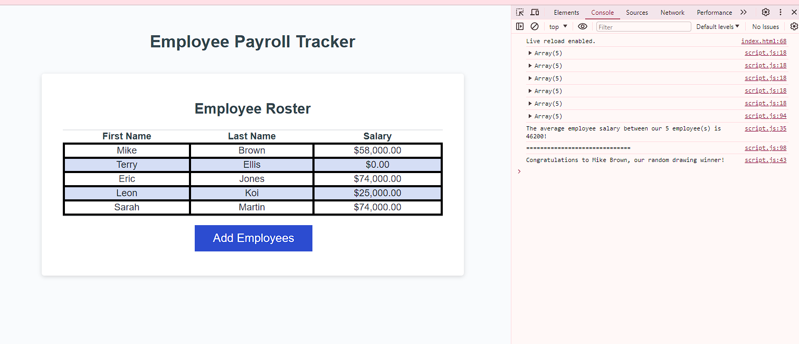

# Employee-Payroll
JavaScript code allowing user to input employee data and make an average employee salary calculation as well as choose a random employee for a drawing winner.

Live link to page: https://drauf727.github.io/Employee-Payroll/

Screenshot of working application: 
